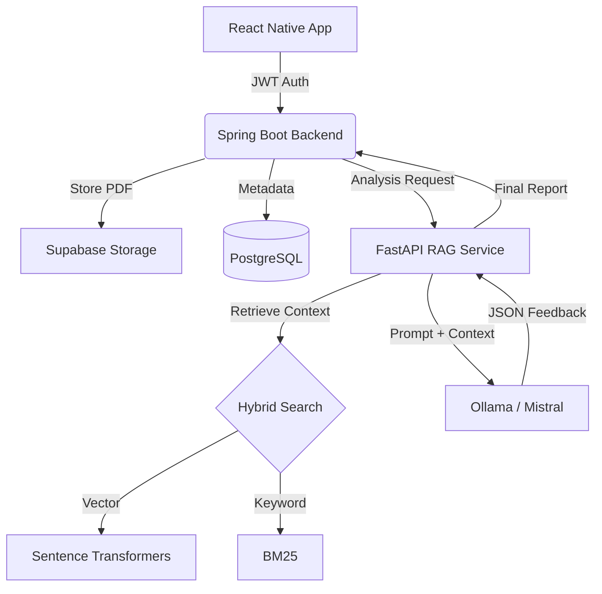

```
# 🚀 ResumeIQ – AI-Driven Resume Intelligence with Hybrid RAG

[](https://www.python.org/)
[](https://spring.io/projects/spring-boot)
[](https://reactnative.dev/)
[](https://ollama.ai/)

**ResumeIQ** is a sophisticated full-stack ecosystem designed to bridge the gap between static resumes and actionable career insights. By leveraging a **Retrieval-Augmented Generation (RAG)** pipeline and local LLMs, it provides deep-context analysis that standard ATS systems miss.

---

## 🧠 Core Features

* **⚡ Intelligent ATS Scoring:** Real-time compatibility parsing using a Spring Boot microservice.
* **🔍 Hybrid RAG Analysis:** Goes beyond keyword matching. Uses vector similarity (semantic) + BM25 (keyword) to provide structural and skill-based feedback.
* **📱 Mobile-First Experience:** Seamless PDF uploads and history tracking via a React Native (Expo) interface.
* **🔒 Privacy-Centric AI:** Powered by **Ollama**, ensuring resume data is processed locally/privately without third-party API dependency.
* **📂 Cloud Persistence:** Secure document handling via Supabase Storage and PostgreSQL.

---

## 🏗️ System Architecture

The project follows a decoupled **Microservices Architecture** to ensure scalability and separation of concerns:

1.  **Frontend (Mobile):** React Native / TypeScript – Handles user interaction and file picking.
2.  **Orchestration Layer:** Spring Boot – Manages Auth (JWT), User Data, and interfaces with Supabase.
3.  **Intelligence Layer:** FastAPI – The RAG engine. Handles PDF extraction, chunking, and LLM inference.



---

## 🛠️ Tech Stack

| Layer | Technologies |
| --- | --- |
| **Frontend** | React Native (Expo), TypeScript, Axios, React Navigation |
| **Backend** | Java, Spring Boot, Spring Security (JWT), Maven |
| **AI/ML** | FastAPI, LangChain/LlamaIndex concepts, PyTorch, Sentence-Transformers |
| **Database** | PostgreSQL, Supabase (Storage & DB) |
| **Inference** | Ollama, Mistral-7B-Instruct |

---

## 🔬 Technical Deep Dive: The RAG Pipeline

To ensure the AI doesn't "hallucinate" resume advice, we implemented a **Hybrid Retrieval** strategy:

1. **Parent-Child Chunking:** We store small chunks for high-precision retrieval but pass larger "parent" contexts to the LLM for better coherence.
2. **Hybrid Search:** Combines **Cosine Similarity** (to understand that "Java" is related to "Backend") with **BM25** (to ensure specific terms like "Kubernetes" aren't missed).
3. **Reranking:** The top-k results are re-scored to ensure only the most relevant resume sections are sent to the Mistral model.

---

## 🚀 Installation & Setup

### 1. AI Service (FastAPI)

```bash
cd rag_core
pip install -r requirements.txt
# Ensure Ollama is running: 'ollama run mistral'
python -m uvicorn rag_api:app --reload --port 8001

```

### 2. Backend (Spring Boot)

```bash
cd SpringBoot/hello
./mvnw spring-boot:run

```

### 3. Frontend (React Native)

```bash
cd Front/mineapp
npm install
npx expo start

```

---

## 📌 Future Roadmap

* [ ] **Job Description Matching:** Upload a JD and get a % match score.
* [ ] **Vector DB Persistence:** Migrating from in-memory to ChromaDB or PGVector.
* [ ] **Quantification Engine:** Specifically identifying where users can add metrics (e.g., "Increased efficiency by X%").

---

## 👨‍💻 Author

**Suchet Amaljari**

---

⭐ **If you find this architecture interesting, please consider starring the repository!**

```

---
